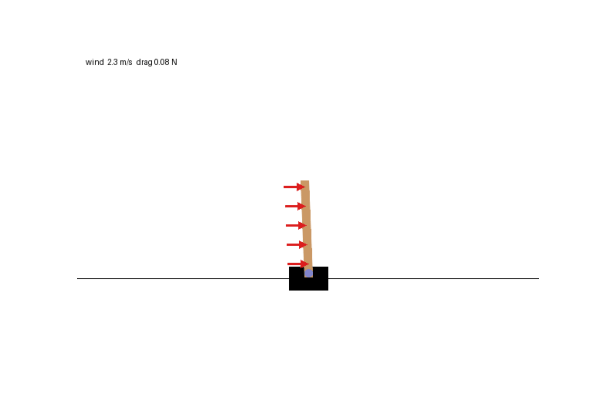
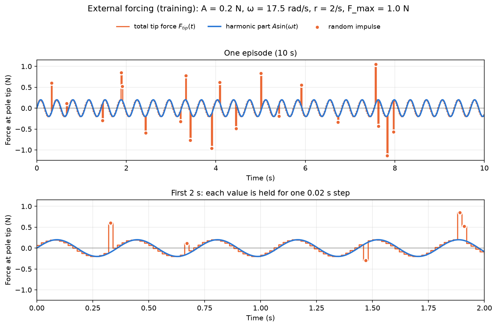

# PPO Cartpole with Wind Forcing and Perception Latency

This project trains a PPO (Proximal Policy Optimization) agent to solve the classic CartPole problem in Gymnasium. Gymnasium simulates the dynamics of the environment, and provides the reward.

At each time step, the agent chooses one of two actions:
- apply a constant force to the left
- apply a constant force to the right.

The state of the environment is given by four continuous variables, $s = [x, \dot{x}, \theta, \dot{\theta}]$: the cart position and velocity, and the pole angle and angular velocity.

On top of standard CartPole, I added two complications, each implemented as a Gymnasium wrapper in the notebook:

1. **External forcing**. A steady mean wind plus random turbulent gusts blows on the pole and the cart, which produce aerodynamic drag on both. The agent only sees its effect on the cart and pole. [External forcing: wind](#external-forcing-wind).

2. **Perception latency**. The agent sees the state $[x, \dot{x}, \theta, \dot{\theta}]$ from 2 steps ago and acts on it as if it were the current state. [Perception latency](#perception-latency).

## Episodes, termination and reward

An episode is one attempt to balance the pole for 500 steps or until it fails.

- **Failure:** the episode ends prematurely  if the pole tilts more than 12 degrees from upright position, $|\theta| > 0.2094$ rad, or if the cart leaves the track, $|x| > 2.4$ m.

- **Time limit:** the episode has a maximum time limit of 500 steps (10 s).

- **Reward:** +1 for every step the pole stays up.

The reward is +1 on every time step. Failing early results less fewer discounted future rewards.  Failing to keep within the limits of 12° and 2.4 m turns balancing pole into a learnable objective. 

When balancing fails, the future rewards are zero. Actions that led toward failure get lower advantages, and the policy learns to avoid them.

When the time limit of 500 steps is reached successfully, the Value function's estimate of future rewards $V(s)$ is used in place of the missing future. 

## PPO agent

- Actor model $\pi_\theta(a \mid s)$ outputs action probabilities from the observed state,
- Critic model $V_\phi(s)$: estimates the expected return from that state,

The true objective is the expected discounted return of the policy:

$$
J(\theta) = \mathbb{E}_{\tau \sim \pi_\theta}\Big[\sum_t \gamma^t r_t\Big]
$$

$J$ cannot be optimized directly: evaluating it for new weights $\theta$ requires collecting new episodes. PPO instead optimizes a surrogate objective computed from data collected with the previous policy $\pi_{\theta_{old}}$. Near $\theta_{old}$, the surrogate has the same gradient as $J$.

PPO algorithm trains actor model by gradient ascent on the clipped objective function.

$$
L^{CLIP}(\theta) = \mathbb{E}_t\Big[\min\big(r_t(\theta)\,A_t,\ \text{clip}\big(r_t(\theta),\,1-\epsilon,\,1+\epsilon\big)\,A_t\big)\Big]
$$

$$
r_t(\theta) = \frac{\pi_\theta(a_t \mid s_t)}{\pi_{\theta_{old}}(a_t \mid s_t)}
$$

with $\epsilon = 0.2$: the clip keeps each action's probability within ±20% of its value under the policy that collected the data. 

The advantage $A_t$ is computed with generalized advantage estimation (GAE):

$$
\delta_t = r_t + \gamma V_\phi(s_{t+1}) - V_\phi(s_t)
$$

$$
A_t = \sum_{k \ge 0} (\gamma\lambda)^k\, \delta_{t+k}
$$

with $\gamma = 0.99$, $\lambda = 0.95$. The critic is fit to the returns $A_t + V_\phi(s_t)$ by mean squared error.

Derivations of the policy gradient, the clipped objective and GAE: [PPO notes](PPO_NOTES.md).

## Inference and rendering

The GIF shows one episode of inference. 

- At each step the agent takes the most likely action, $\arg\max_a \pi(a \mid s)$.

- We first run 20 evaluation episodes with fixed seeds 0–19 and print the length of each. The GIF replays the longest one. With the current seeds, 11 of the 20 episodes continue for the full 500 steps, the other nine fail between 113 and 488 steps (median over all 20: 500). The GIF shows a successful episode, which is slightly more common than not.

- GIF plays at 50 Hz, one frame per simulation step ($\Delta t = 0.02$ s), so it plays in real time.

## Physics model

Cartpole is a simple coupled mechanical system: a cart moves along the x-axis while a pole rotates about the pivot. The task of the agent is to keep the pole balanced.

Gymnasium models the pole as a uniform rod of mass $m$ and length $2l$ (its `length` parameter is $l$) on a cart of mass $M$. The angle $\theta$ is measured clockwise from upright position. With a horizontal force $F$ applied by the agent on the cart, the coupled equations of motion are:

Conservation of linear momentum in x-dir:
$$
F = (M + m)\,\ddot{x} + m l \cos\theta\,\ddot{\theta} - m l \dot{\theta}^2 \sin\theta
$$

Conservation of angular momentum around z axis:
$$
m g l \sin\theta = \tfrac{4}{3} m l^2\,\ddot{\theta} + m l \cos\theta\,\ddot{x}
$$

The first equation is $F = M\ddot{x} + m\,\ddot{x}_{cm}$, where $x_{cm} = x + l\sin\theta$ is the horizontal position of the pole's center of mass:

$$
\ddot{x}_{cm} = \ddot{x} + l\cos\theta\,\ddot{\theta} - l\sin\theta\,\dot{\theta}^2
$$

- $\ddot{x}$: the pivot moves with the cart.
- $l\cos\theta\,\ddot{\theta}$: horizontal component of the pole's tangential acceleration.
- $-l\sin\theta\,\dot{\theta}^2$: horizontal component of its centripetal acceleration. Relative to the pivot, the center of mass moves on a circle of radius $l$, so it has acceleration $l\dot{\theta}^2$ directed along the pole toward the pivot. A fast-swinging pole pulls on the pivot along its axis, and when tilted, part of that pull acts horizontally on the cart. The term is nonlinear, of order $\theta\dot{\theta}^2$ near upright, so it vanishes when the equations are linearized; the simulation keeps it.

In the second equation, the term $m l \cos\theta\,\ddot{x}$ reflects the inertial torque from the accelaration of the pivot that connects the pole to the cart, since it accelerates with the cart. 

$\tfrac{4}{3} m l^2$ is the rod's moment of inertia about the pivot. The $\cos\theta$ terms couple the two: accelerating the cart tips the pole, and the swinging pole pushes back on the cart. Gravity ($+m g l \sin\theta$) makes the upright position unstable.

These are Gymnasium's equations, without wind. The wind adds external forces on both bodies: the drag on the cart $F_{cart}$ and the drag on the pole $F_{pole}$ (acting at mid-pole). With them the equations become

$$
F + F_{cart} + F_{pole} = (M + m)\,\ddot{x} + m l \cos\theta\,\ddot{\theta} - m l \dot{\theta}^2 \sin\theta
$$

$$
m g l \sin\theta + F_{pole}\, l \cos\theta = \tfrac{4}{3} m l^2\,\ddot{\theta} + m l \cos\theta\,\ddot{x}
$$

See [External forcing: wind](#external-forcing-wind) for how the wind forces are computed and applied.

There is **no friction**: neither between the cart and the track nor at the pivot. (The original Barto et al. (1983) model had both; Gymnasium drops them.)

| Parameter | Symbol | Value |
|---|---|---|
| Cart mass | $M$ | 1.0 kg |
| Pole mass | $m$ | 0.1 kg |
| Pole half-length | $l$ | 0.5 m (full pole 1.0 m) |
| Gravity | $g$ | 9.8 m/s² |
| Agent's force on the cart | $F$ | ±10 N |
| Time step | $\Delta t$ | 0.02 s |

## Time integration

Gymnasium advances the system in discrete time steps of $\Delta t = 0.02$ s. At each step:

1. The agent's force $F = \pm 10$ N is held constant over the whole step.
2. The equations of motion above are solved for $\ddot{x}$ and $\ddot{\theta}$ from the current state.
3. The state is advanced with explicit (forward) Euler integration. Positions use the velocities from the *start* of the step:

$$
x_{n+1} = x_n + \Delta t\,\dot{x}_n, \qquad \dot{x}_{n+1} = \dot{x}_n + \Delta t\,\ddot{x}_n
$$

$$
\theta_{n+1} = \theta_n + \Delta t\,\dot{\theta}_n, \qquad \dot{\theta}_{n+1} = \dot{\theta}_n + \Delta t\,\ddot{\theta}_n
$$

Gymnasium can also use semi-implicit Euler (`kinematics_integrator="semi-implicit euler"`), which updates velocities first and then advances positions with the new velocities. This project uses the default, explicit Euler.

Explicit Euler is not energy-conserving, but the pole never swings past 12° (see below), so the drift is negligible here.

## External forcing: wind

Wind blows horizontally on the pole and the cart, modeled the way wind loads are modeled in engineering: a mean wind plus turbulent gusts, converted to forces by aerodynamic drag.

The wind speed is a steady mean plus random fluctuations:

$$
u(t) = U + u'(t)
$$

The gust $u'(t)$ follows the **von Kármán turbulence spectrum**, the standard model for atmospheric turbulence:

$$
S_u(f) = \sigma_u^2\,\frac{4\,T_L}{\big(1 + 70.8\,(f\,T_L)^2\big)^{5/6}}, \qquad T_L = \frac{L}{U}
$$

where $\sigma_u$ is the gust intensity and $T_L$ the integral time scale (the duration of turbulent wind gust). 

**Drag force.** The same wind acts on both bodies. Each experiences a quadratic wind drag force:

$$
F(t) = \tfrac{1}{2}\,\rho\,C_d\,A\,|u(t)|\,u(t)
$$

with its own drag coefficient $C_d$ and frontal cross-sectional area $A$ :

- Pole is a circular cylinder. The load is spread uniformly along the pole.
- Cart is a cube whose side is 1/5 of the pole length (0.2 m).

| Parameter | Symbol | Value |
|---|---|---|
| Mean wind speed | $U$ | 2.5 m/s (a light breeze) |
| Turbulence intensity | $\sigma_u / U$ | 30% ($\sigma_u$ = 0.75 m/s) |
| Turbulence length scale | $L$ | 5 m ($T_L$ = 2 s) |
| Air density | $\rho$ | 1.2 kg/m³ |
| Pole: drag coefficient (cylinder) | $C_d$ | 1.2 |
| Pole: diameter | $D$ | 2 cm (frontal area 0.02 m²) |
| Cart: drag coefficient (cube, face-on) | $C_d$ | 1.05 |
| Cart: side length | | 0.2 m (frontal area 0.04 m²) |
| Resulting drag on the pole | $F_{pole}$ | about 0.09 N mean, 0.01–0.22 N over an episode |
| Resulting drag on the cart | $F_{cart}$ | about 0.16 N mean, up to 0.39 N over an episode |

The cart has twice the pole's frontal cross-sectional area. The same wind model is used in training and inference.

The figure shows one 10 s episode (seeded for reproducibility). Top: the wind speed, with slow gusts lasting a few seconds and small fast fluctuations on top, as in real wind. Bottom: the resulting drag force on the cart and on the pole. The force on the cart is larger because of its larger crossectional area. Since the wind force is proportional to $u^2$, gusts are amplified. The wind varies by about ±30%, but the forces vary by more than a factor of ten.

**Applying the forces.** Over one time step $\Delta t$, the wind force is applied as an impulse $J = F\,\Delta t$, which changes $\dot{x}$ and $\dot{\theta}$ through the mass matrix of the equations of motion. The generalized impulse depends on where the force acts:

- **Pole** (at height $l$): $(J_{pole},\; l\cos\theta\,J_{pole})$. It pushes the system and tips the pole directly.
- **Cart** (at the cart): $(J_{cart},\; 0)$. It exerts no torque on the pole directly, but accelerating the cart tips the pole through the $\cos\theta$ coupling, just like the agent's own push.

Both impulses are applied just before Gymnasium's Euler step.

**Why the wind is limited to a light breeze.** Real wind has a nonzero mean, so to stay balanced the pole must lean *into* the wind. With the pole's drag and weight both acting at mid-pole, and the cart held stationary on average, the steady equilibrium lean is

$$
\sin\theta_{eq} = \frac{F}{m\,g}
$$

where $F$ is the drag on the pole; the cart's drag does not change the lean. The pole weighs only 0.1 kg ($m g$ = 0.98 N), so it is very sensitive to wind. At 2.5 m/s the mean drag of 0.09 N gives a lean of about 5°. At 4 m/s the lean would be about 14°, beyond the 12° failure limit: no controller could keep the pole up. The largest tolerable mean drag is $m g \sin 12° \approx 0.20$ N.

The per-step kick from the wind is small compared with the agent's own push:

The difficulty is that the wind pushes **persistently in one direction**. Together the pole and cart catch about 0.25 N of mean drag, so the whole system is blown downwind. The agent has to hold the pole tilted into the wind.

## Perception latency

The agent perceives the state $\tau = 0.04$ s (2 time steps) late. At step $n$ its only input is the state from 2 steps earlier,

$$
o_n = s_{n-2} = [x, \dot{x}, \theta, \dot{\theta}]_{n-2}
$$

and it acts on it as if it were the current state. This models the time it takes to sense the cart and pole and process what it sees before acting. 

**Efference copy.** The brain faces the same problem, sensory feedback arrives 100–200 ms late. It compensates with an efference copy, an internal copy of each motor command sent to the brain regions that predict movement. Combining the delayed sensory signal with the commands issued since, it estimates the body's current state before the feedback arrives (a forward model). Autonomous vehicles do the same, under the name latency compensation.

The PPO agent here has no efference copy, it acts on the delayed state alone.

## Project contents

- `ppo_cartpole.ipynb` — full PPO implementation, training loop, diagnostics, and animation export
- `pyproject.toml` — project dependencies
- `resources/` — generated diagnostic figures and animation artifacts.

## Environment

- Python
- Gymnasium
- PyTorch
- NumPy
- Matplotlib
- Pillow
- pygame (used by Gymnasium to render the animation)
